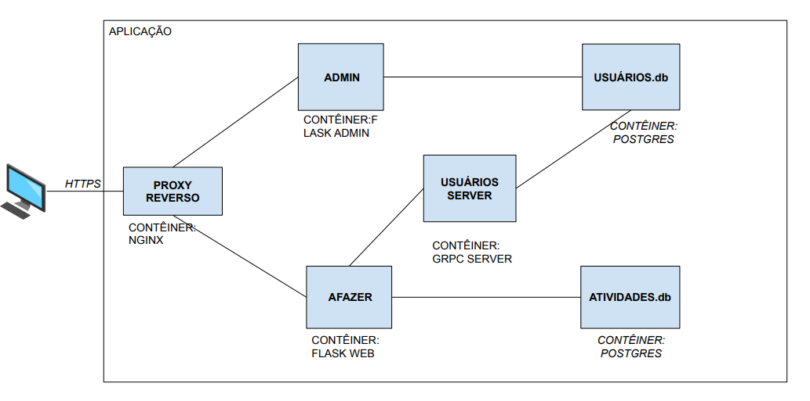
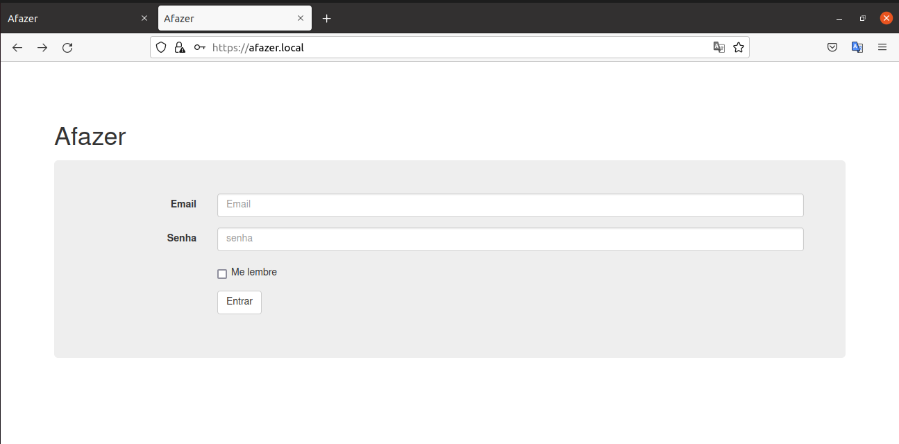
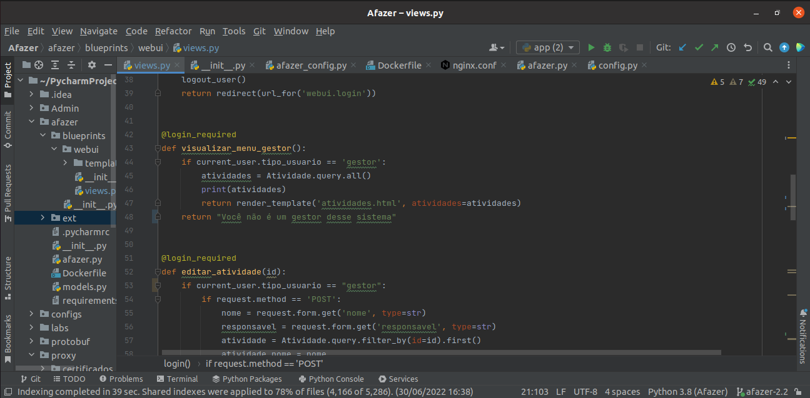

Afazer é uma aplicação para gerenciar atividades que eu criei para ser utilizada no meu TCC para para mostar de forma prática os métodos e técnicas de segurança na construção de uma aplicação contêinerizada. A aplicação é composta por três tipos de indivíduos:
* Usuários: é responsável por fazer as atividades para ele designadas, podendo apenas visualizar suas atividades e editar  os status delas em Por fazer, Fazendo e Finalizado;
* Gestor: responsável por designar as atividades aos usuários, tendo acesso ao CRUD de todas atividades;
* Admin: responsável por cadastrar, editar e excluir os usuários e gestores da aplicação Afazer.

Siga os seguintes passos para a execução dessa aplicação:
* intalar o Docker e Docker compose;
* Em seguida basta clonar este projeto e acessar o diretório raiz da aplicação pelo terminal ou editor de código de sua preferência;
* Executar o comando docker-compose up.

A seguir é mostrado o diagrama da aplicação Afazer:

 

 
Para os usuários serem autenticados na aplicação Afazer, é necessário apresentar suas credenciais(e-mail e senha):

 

O Flask-login, uma extenção do Flask para fazer autenticação, fornece o decorador @login\_required que protege o acesso as páginas da aplicação Afazer, disponibilizando apenas para quem está autenticado. Na imagem abaixo é possível ver o uso desse recurso no código.

 
